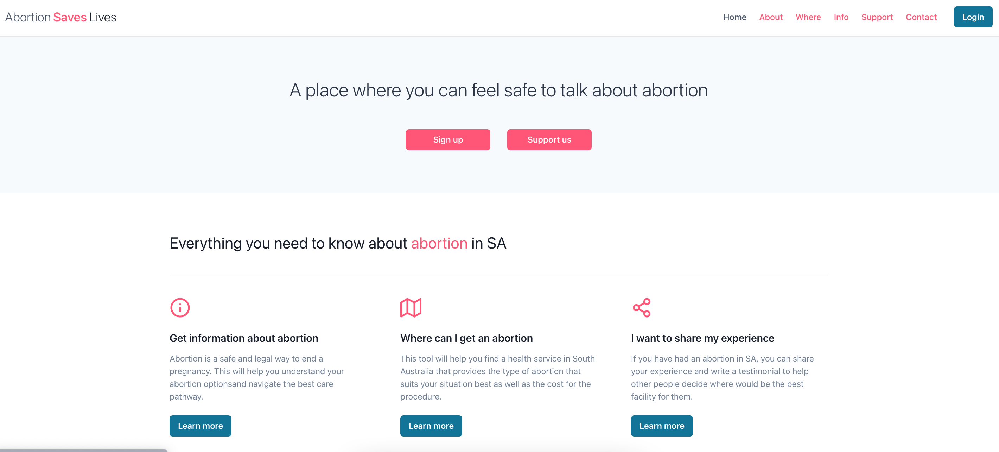

# Abortion-saves-lives

## Table of content

- [Description of Project](#description-of-project)
- [Technologies used](#technologies-used)
- [Challenges](#challenges)
- [Link to deployed application](#link-to-deployed-application)
- [Screenshot of deployed application](#screenshot-of-deployed-application)

## Description of Project

Have you noticed that some very hard-won and basic women rights have been overturned in the world over the last couple of years? Well, I have noticed and it is unbearable. The most striking example for me has been the reversal of Roe v Wade in the United States. This led me to think that we have to talk more about abortion and normalise it. Abortion is common, 1 in 4 women will have an abortion in their lifetime. shouldn’t we stop talking about it with shame and remove the stigma around it? The abortion saves lives app will allow South Australian people to look for abortion providers in their state and to give testimonials about their experience to help others make the decision on where to have their procedure.

## Technologies Used

Here are all of the technologies that I used for this project: 
- MERN stack (MongoDB, Express, React and Node.js) 
- The component library Chakra UI for the styling
- GraphQL for querying my database
- Bcrypt for password hashing
- Heroku for the deployment
- EmailJS
- JSON Web Token

## Challenges

The main challenges I encountered were deployment related as well as integration Strip. I have worked with Heroku before but deploying with data and a React application was new and a little daunting. Initially my routes were not working and my applications was not seeded with data. I was able to replace my fix my routes and seed my database directly on the heroky dev center terminal.
The stripe integration is still work in progress and the implementation is ongoing.

### Link to deployed application

[Link to deployed application](https://abortion-saves-lives.herokuapp.com/)

### Screenshot of deployed application

